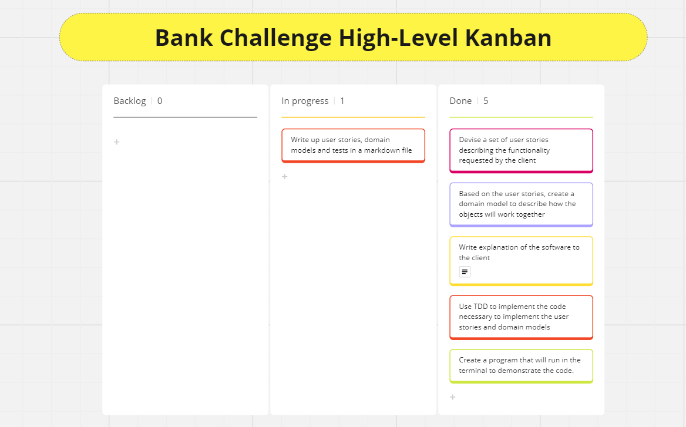
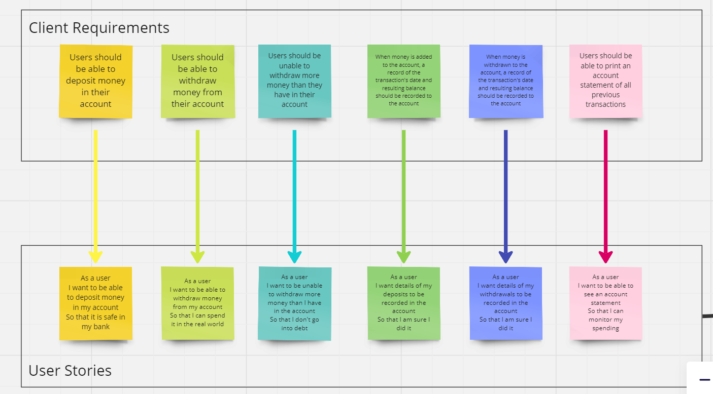
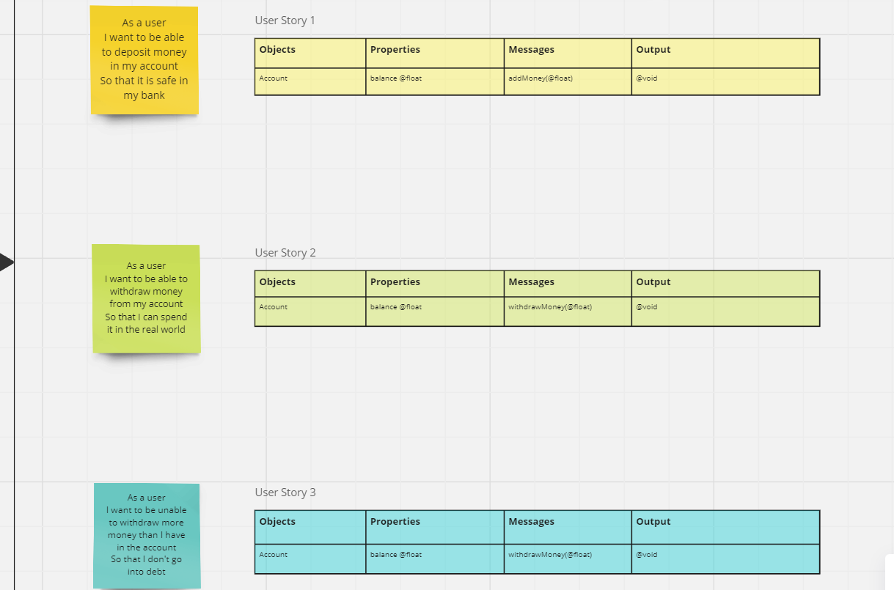
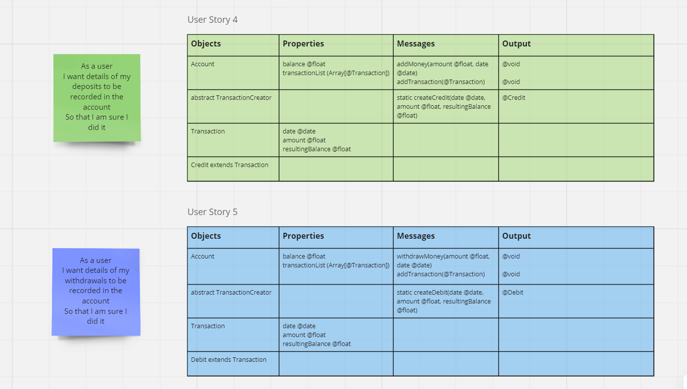
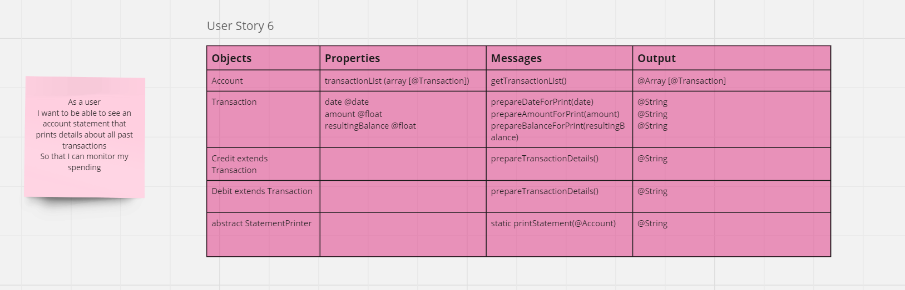
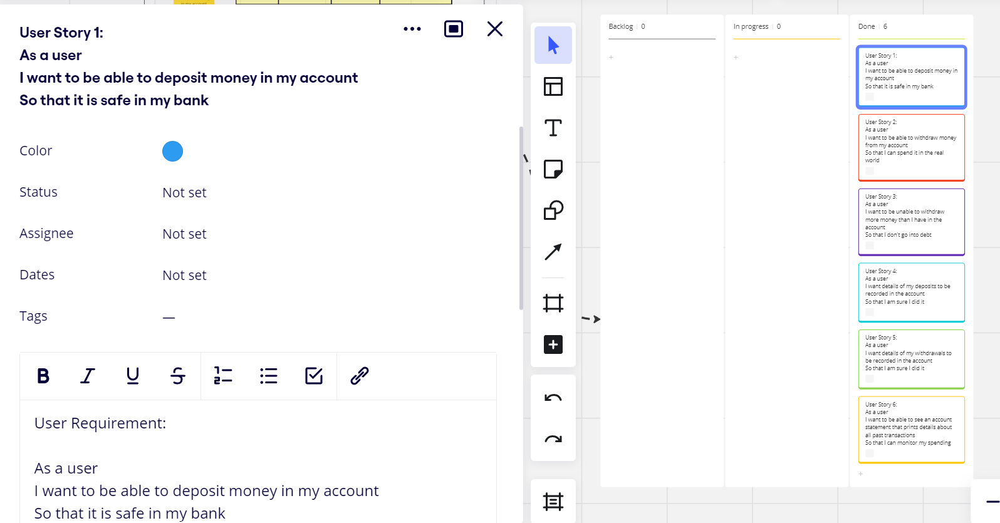

# Domain Models and Test Plan

### Kanban board showing overall breakdown of tasks to be completed.
;

### Client requirements converted into user stories.

### Each user story then has a corresponding domain model showing the properties, messages and output required for the specific functionality to be implemented.

### Kanban board for setting out the tests to be used during the test-driven development of the software.

### Full details of the tests for each user story:
---
*User Story 1:*
As a user
I want to be able to deposit money in my account
So that it is safe in my bank

* Test that a new account is initialised with a balance of 0
* Test that when I deposit into an empty account, the new balance is equal to the amount deposited
* Test that if I deposit into an account with a positive balance, the balance increases by exactly the amount deposited
* Test that if I add 0 to the account, the balance remains the same
* Test that if I attempt to add a negative number to the account, the balance remains the same
* Test that if I attempt to add a value of null to the account, the balance stays the same
* Test that if I attempt to add a value which has more than 2 decimal places, the number is rounded down to 2dp before changing the balance
---
*User Story 2:*
As a user
I want to be able to withdraw money from my account
So that I can spend it in the real world

* Test that when I withdraw from an account with a positive balance, the balance decreases by exactly the amount withdrawn
* Test that if I withdraw 0 from the account, the account balance stays the same
* Test that if I attempt to withdraw a negative number from the account, the account balance stays the same
* Test that if I attempt to withdraw a null value from the account, the balance stays the same
* Test that if I attempt to withdraw a value which has more than 2 decimal places, the number is rounded down to 2dp before changing the balance
---
*User Story 3:*
As a user
I want to be unable to withdraw more money than I have in the account
So that I don't go into debt

* Test that if I attempt to withdraw money from an account with a balance of 0, the balance stays the same
* Test that if I attempt to withdraw money with a greater value than the account's balance, the balance stays the same
---
*User Story 4:*
As a user
I want details of my deposits to be recorded in the account
So that I am sure I did it

Account Tests:
* *Test that when I successfully add money to the account, createCredit() is called* - was unable to successfully test this using spy objects
* Test that when I successfully add money to the account, addTransaction() is called
* Test that when I successfully add money to the account, the length of the account's transactionList increases by 1
* *Test that when I successfully add money to the account, the account's TransactionList's final element is a Credit* - was unable to successfully test this using spy objects
* Test that when I successfully add money to the account, the account's TransactionList's final element has a date property equal to expected
* Test that when I successfully add money to the account, the account's TransactionList's final element has an amount property equal to expected
* Test that when I successfully add money to the account, the account's TransactionList's final element has a resultingBalance property equal to expected

TransactionCreator tests:
* Test that when I create a Credit with TransactionCreator, the resulting Credit is of type Credit

Credit tests:
* Test that when I create a Credit, the resulting Credit has the correct date property
* Test that when I create a Credit, the resulting Credit has the correct amount property
* Test that when I create a Credit, the resulting Credit has the correct resulting balance property
---
*User Story 5:*
As a user
I want details of my withdrawals to be recorded in the account
So that I am sure I did it

* *Test that when I successfully withdraw money from the account, createDebit() is called* - was unable to successfully test this using spy objects
* Test that when I successfully withdraw money from the account, addTransaction() is called
* Test that when I successfully withdraw money from the account, the length of the account's transactionList increases by 1
* *Test that when I successfully withdraw money from the account, the account's TransactionList's final element is a Debit* - was unable to successfully test this using spy objects
* Test that when I successfully withdraw money from the account, the account's TransactionList's final element has the same amount property as expected
* Test that when I successfully withdraw money from the account, the account's TransactionList's final element has the same date property as expected
* Test that when I successfully withdraw money from the account, the account's TransactionList's final element has the same resultingBalance property as expected

TransactionCreator tests
* Test that when I create a Debit with TransactionCreator, the resulting Debit is of type Debit
Debit tests
* Test that when I create a Debit with TransactionCreator, the resulting Debit has a date property
* Test that when I create a Debit with TransactionCreator, the resulting Debit has an amount property
* Test that when I create a Debit with TransactionCreator, the resulting Debit has a resulting balance property
---
*User Story 6:*
As a user
I want to be able to see an account statement that prints details about all past transactions
So that I can monitor my spending

* Test that using prepareTransactionDetails on a Credit object returns a string in the correct format
* Test that using prepareTransactionDetails on a Debit object returns a string in the correct format
* Test that using printStatement() produces the correct console output